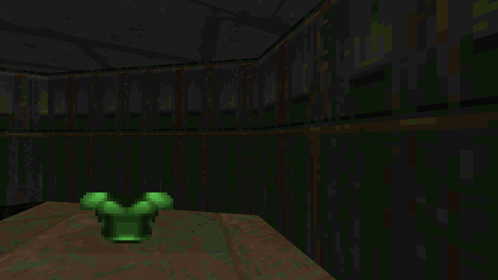

# Three Doom for Photoshop UXP

Run Doom inside a resizable Adobe Photoshop 2026 plugin panel and measure the
WebView's real-time WebGL performance.



> **Branch focus — live Photoshop texture editing**
>
> `agent/live-start-texture` is the experimental development branch for
> exporting a Doom wall texture into a layered Photoshop document, editing it,
> and applying the composite back to the running game without reloading the
> map or WebView. Version 1.6.0 adds a scrolling visual browser for all 125
> wall textures in the shareware WAD, plus Select, Open, Apply, and Restore
> controls. This work has not been merged into `main`.
>
> See [CHANGELOG.md](CHANGELOG.md) for the branch history.

## Three.js Doom port and credits

This project embeds and adapts
**[mrdoob/three-doom](https://github.com/mrdoob/three-doom)**, a Three.js port
of Doom created by [@mrdoob](https://github.com/mrdoob) with
[@claude](https://github.com/claude). The vendored source is based on upstream
commit
[`6ecabebcba66bf534af5ea925c97411ccc1163e4`](https://github.com/mrdoob/three-doom/commit/6ecabebcba66bf534af5ea925c97411ccc1163e4).

Doom was originally created by id Software. The original released Doom source
is available from [id-Software/DOOM](https://github.com/id-Software/DOOM).
This repository includes Three.js 0.184.0 and the shareware `doom1.wad`
distributed by the upstream Three Doom project.

The Three Doom code is licensed under GPL v2; see [COPYING](COPYING).
Three.js is licensed under the MIT License; see
[THREE-LICENSE](THREE-LICENSE). Additional attribution is in
[THIRD-PARTY-NOTICES.md](THIRD-PARTY-NOTICES.md).

## What this project does

Photoshop's native UXP canvas exposes a 2D context, while Three Doom requires
WebGL. This plugin runs the game in a local UXP WebView and provides:

- A resizable Photoshop panel containing the playable game
- Local, offline Doom, Three.js, and shareware WAD assets
- An embedded WAD that avoids local WebView fetch and CORS failures
- Live FPS, P95 callback interval, and estimated dropped-frame metrics
- WebGL version and retained-frame status
- A visible boot log with a one-click **Copy log** button
- WebView load, startup, resource, JavaScript, and stalled-boot diagnostics
- An experimental layered Photoshop wall-texture editor with no-reload Apply
  and Restore
- A scrolling visual browser for every wall texture defined by the WAD

No remote network access is required while the plugin is running.

## Requirements

- Adobe Photoshop 27.4 (Photoshop 2026) or newer
- Adobe UXP Developer Tool

Photoshop 27.4 includes UXP 9.2, which supports local HTML files in a WebView.

## Add the plugin to Photoshop

1. Clone this repository or download and extract its ZIP from GitHub.
2. Open **Adobe UXP Developer Tool**.
3. Click **Add Plugin**.
4. Select the repository's `manifest.json`.
5. Select **Three Doom Benchmark** in UXP Developer Tool.
6. Click **Load & Watch**.
7. In Photoshop, open **Plugins → Three Doom Benchmark**.
8. Resize the panel as desired, then click inside the game before using its
   controls.

After changing the manifest or its permissions, unload and reload the plugin.
If UXP Developer Tool retains an older manifest, remove the plugin entry and
add `manifest.json` again.

## Controls

| Input | Action |
| --- | --- |
| `W` / `S` | Move forward / backward |
| `A` / `D` | Strafe left / right |
| Arrow keys or mouse | Turn |
| Ctrl or left mouse | Fire |
| Space | Use / open |
| Shift | Run |
| Escape | Open the menu |
| Tab | Automap |

Click inside the game first so the WebView receives keyboard and mouse input.

## Benchmark and boot log

The toolbar reports:

- Rolling animation FPS
- P95 animation callback interval
- Estimated dropped 60 Hz frames
- WebGL and game startup status

The Boot log shows the WebView load sequence, embedded WAD byte count, renderer
creation, startup completion, and any errors. Click **Copy log** to place all
visible log lines on the system clipboard. The log text is also selectable.

## Experimental Photoshop texture editor

1. Click **Select Texture** to open the scrolling wall-texture grid over the
   game.
2. Click a thumbnail. The grid closes and the selected name and dimensions
   appear in the Photoshop panel.
3. Click **Open Texture**. The plugin creates a correctly sized, 8-bit RGB
   Photoshop document with an original texture layer and an empty
   **Your edits** pixel layer.
4. Edit that document with normal Photoshop layers.
5. Click **Apply Texture**. The plugin reads the document composite, converts
   its RGB pixels to the nearest colors in Doom's original 256-color palette,
   and updates every live wall mesh using the selected texture.
6. Click **Restore** after applying to restore the indexed pixels loaded from
   the WAD.

Selecting another texture leaves any previously opened Photoshop document
untouched, but detaches it from the editor controls. Click **Open Texture** to
create and track an editable document for the new selection.

The editable document stays RGB because Photoshop's Indexed Color mode limits
layered editing. Palette conversion happens only when applying the composite
to the game. The editable document is never flattened, converted, closed, or
saved automatically. Apply and Restore mutate the existing cached Three.js
`DataTexture`; the game, map, and WebView do not reload.

Photoshop's host requires the composite `imaging.getPixels()` read to execute
inside a short modal scope. The pixel buffer is copied and disposed before the
modal scope ends; palette conversion and the WebView update happen afterward.
The implementation follows Adobe's current
[Imaging API](https://developer.adobe.com/photoshop/uxp/2022/ps-reference/media/imaging/)
and
[`executeAsModal`](https://developer.adobe.com/photoshop/uxp/2022/ps-reference/media/executeasmodal/)
documentation.

The picker contains all 125 wall textures defined by the shareware WAD's
`TEXTURE1` and `TEXTURE2` data. Doom flats and sprites are different WAD
resource types and are not part of this editor yet.

## Project layout

```text
manifest.json            Photoshop UXP Manifest v5 configuration
index.html               Native UXP panel shell
main.js                  WebView bridge, metrics, and boot-log controls
style.css                Resizable panel layout
doom/index.html          Local WebView game page
doom/benchmark.js        WebGL/FPS diagnostics and UXP message bridge
doom/src/                Adapted Three Doom source
doom/vendor/             Vendored Three.js modules
doom/doom1.wad           Shareware Doom Episode 1 data
doom/doom.bundle.js      Generated browser bundle with embedded WAD
```

## Rebuild the game bundle

Run this from the `doom` directory:

```sh
npx --yes esbuild@0.25.12 src/i_main.js \
  --bundle \
  --format=iife \
  --platform=browser \
  --target=safari16 \
  --loader:.wad=binary \
  --outfile=doom.bundle.js \
  --legal-comments=inline \
  --charset=utf8
```

The `.wad` binary loader embeds the default shareware WAD in
`doom.bundle.js`. That avoids the status-0 response Photoshop's local WebView
can return when fetching the WAD as a separate relative binary resource.

## Technical notes

- The outer panel loads `plugin:/doom/index.html` in an
  `HTMLWebViewElement`.
- The WebView bridge is restricted to local plugin content.
- The Three.js renderer uses `preserveDrawingBuffer: true` so Photoshop's
  WebView compositor receives a retained frame.
- Device pixel ratio is capped at 2 to limit rendering overhead.
- The generated bundle replaces the runtime ES-module graph to avoid
  module-origin/CORS behavior.
- Clipboard access is used only after the user clicks **Copy log**.

## License

The adapted Three Doom code is distributed under the GNU General Public
License version 2. See [COPYING](COPYING). Third-party components retain their
respective licenses and notices.
